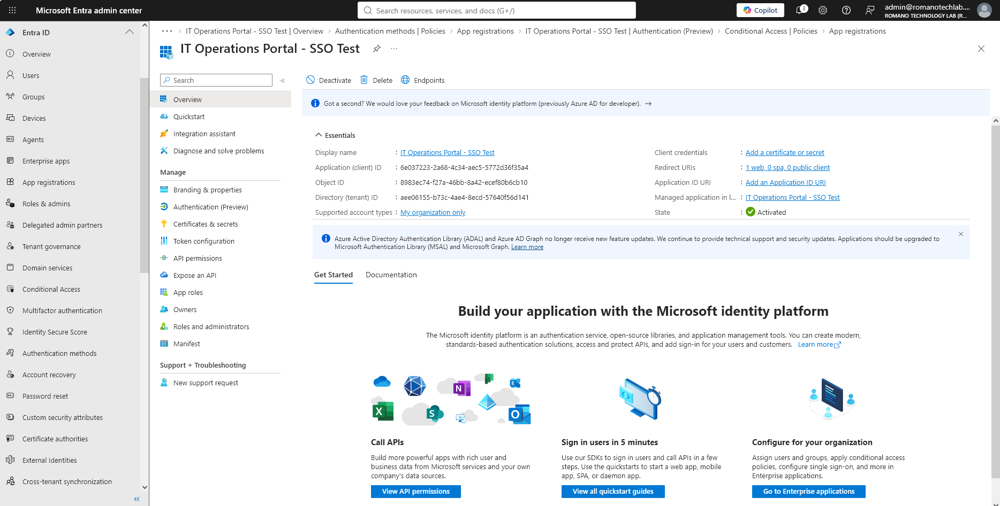
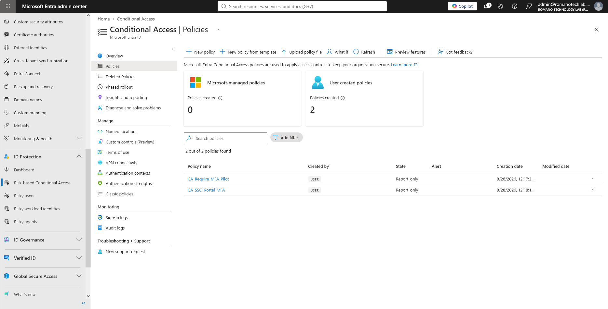

# Phase 2: Advanced Microsoft Entra ID & SSO Integration

## Objective
To demonstrate enterprise-level Identity and Access Management (IAM) by integrating a custom internal web application (IT Task Manager) with Microsoft Entra ID for Single Sign-On (SSO) and enforcing Zero Trust security policies.

## Project Scope & Technical Implementation

In this phase, I expanded the hybrid cloud environment by bridging custom internal tooling with Microsoft 365 identity controls using OpenID Connect (OIDC).

* **Enterprise App Registration:** Registered a single-tenant application (`IT Operations Portal - SSO Test`) within Entra ID to securely route authentication requests. Configured redirect URIs and enabled ID tokens for implicit grant flows.
* **Zero Trust Security:** Designed and deployed a targeted Conditional Access Policy (`CA-SSO-Portal-MFA`) scoped specifically to the IT Support security group. This policy mandates Multi-Factor Authentication (MFA) to prevent unauthorized access to internal operational data.
* **Token Validation & Diagnostic Testing:** Validated the SSO architecture using standard diagnostic tools (`jwt.ms`) to simulate the authentication handshake. Successfully decoded the JSON Web Token (JWT) payload to verify identity claims, including User Principal Names (UPN) and login timestamps.

## Artifacts

### 1. Entra ID Application Registration
*Configured the Client ID, Tenant ID, and restricted the application to internal organization accounts only.*

### 2. Conditional Access Enforcement
*Zero Trust policy applied directly to the Enterprise Application, requiring MFA for IT staff.*

***
