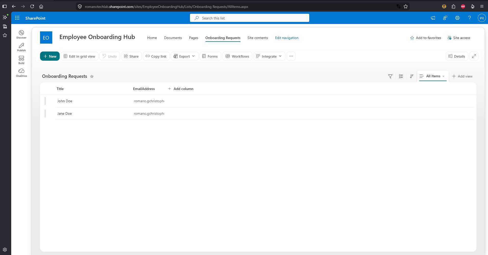
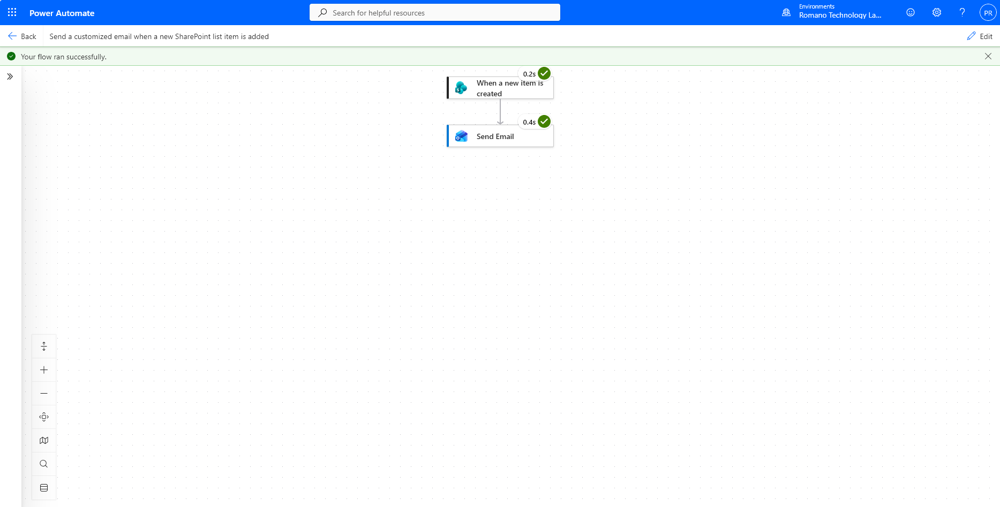

## Project 3: Automated HR Onboarding Workflow (SharePoint & Power Automate)

### Objective
To eliminate manual HR/IT onboarding tasks and improve the new hire experience by automating the distribution of orientation materials using the Microsoft 365 ecosystem.

### Project Scope & Technical Implementation
* **Intranet Development:** Architected a dedicated SharePoint Communication Site (`Employee Onboarding Hub`) to centrally host company history, organizational charts, and orientation videos.
* **Data Intake:** Built a custom SharePoint List (`Onboarding Requests`) to serve as the structured data entry point for HR when processing new hires.
* **Business Process Automation:** Engineered a Power Automate cloud flow triggered dynamically by new item creation in the SharePoint list. 
* **Dynamic Communication:** Configured the flow to extract the new hire's data and automatically dispatch a customized welcome email via Office 365 Outlook, granting immediate access to the onboarding hub and reducing Help Desk setup tickets.

### Artifacts

#### 1. Employee Onboarding Hub (SharePoint)
*Structured intranet site designed for zero-touch employee orientation.*

#### 2. Power Automate Workflow Execution
*Successful flow run demonstrating the trigger, conditional logic, and automated email dispatch.*

***
