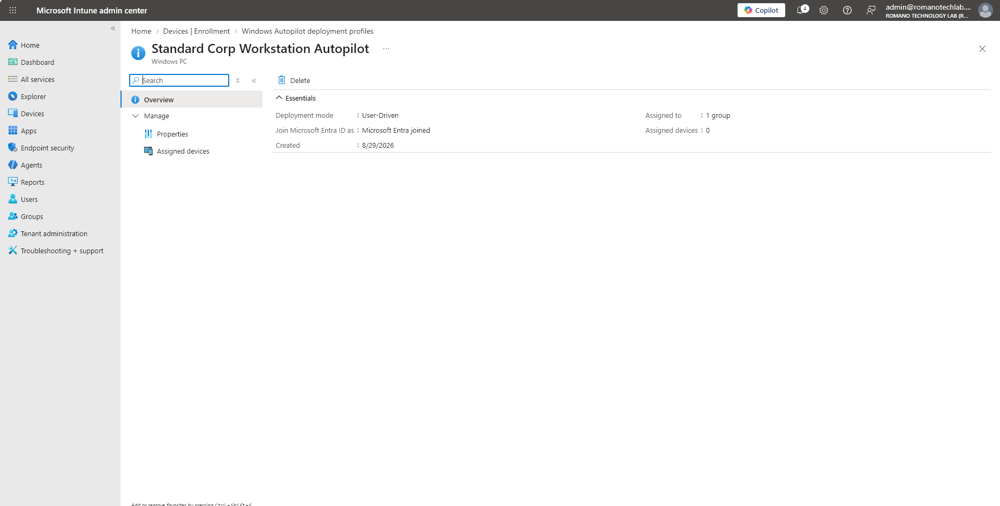
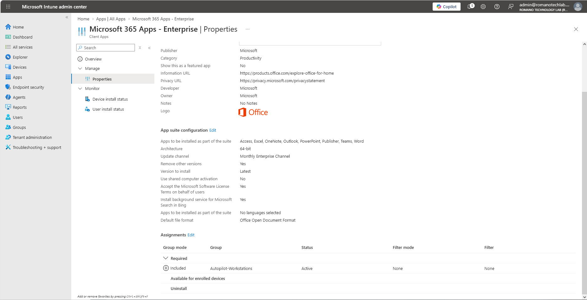

# Phase 4: Modern Endpoint Management & Zero-Touch Deployment (Intune & Autopilot)

## Objective
To establish a modern, cloud-first endpoint management architecture using Microsoft Intune and Windows Autopilot, enabling zero-touch device provisioning, standardized device naming, and automated enterprise software deployment.

## Project Scope & Technical Implementation

* **Dynamic Device Targeting:** Created dynamic Microsoft Entra security groups (`Autopilot-Workstations`) utilizing device rule syntax targeted at Autopilot hardware hashes (`devicePhysicalIDs`) for automatic policy enrollment.
* **Windows Autopilot Deployment Profile:** Engineered a standardized Out-of-Box Experience (OOBE) deployment profile (`Standard Corp Workstation Autopilot`) configured for User-Driven Microsoft Entra Join. Suppressed redundant licensing and privacy setup screens, enforced standard (non-administrator) user roles, and established automated hostname templates (`WRK-%RAND:4%`).
* **Automated Software Distribution:** Packaged and deployed core enterprise software suites (**Microsoft 365 Apps for Enterprise**) targeted as `Required` to managed device groups, ensuring silent background installation without manual IT intervention.
* **Zero-Touch Lifecycle Management:** Designed an end-to-end device provisioning pipeline enabling drop-ship procurement, allowing unconfigured factory hardware to automatically configure itself upon initial employee sign-in.

---

## Artifacts

### 1. Windows Autopilot Deployment Profile
*Configuration showing customized OOBE settings, restricted user privileges, and dynamic group assignment.*

### 2. Required Enterprise App Deployment
*Targeted deployment of Microsoft 365 Apps assigned for automatic installation during device provisioning.*

***
