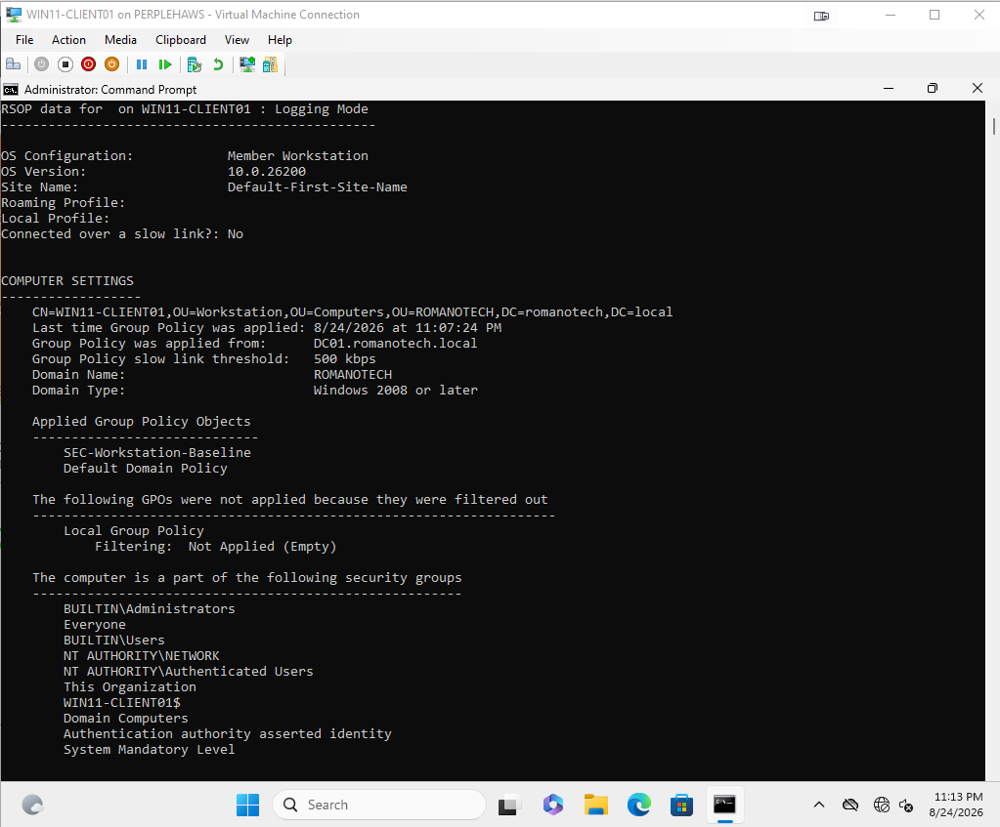

# Romano Technology Lab: Hybrid Identity & Endpoint Management

**Author:** Perry Romano  
**Objective:** Design, deploy, and secure a hybrid enterprise IT infrastructure bridging on-premises Active Directory with Microsoft Entra ID and Intune.

## Executive Summary
This project demonstrates end-to-end configuration of a modern, zero-trust capable IT environment. It simulates a complete corporate infrastructure migration, starting from bare-metal local server provisioning to advanced cloud-based mobile device management (MDM) and Conditional Access enforcement.

## Architecture & Technologies Used
*   **Virtualization:** Microsoft Hyper-V (Private/NAT Networking)
*   **On-Premises Identity:** Windows Server 2022 (Active Directory Domain Services, DNS, Group Policy)
*   **Endpoints:** Windows 11 Pro 
*   **Cloud Identity:** Microsoft 365 Business Premium, Microsoft Entra ID
*   **Modern Management:** Microsoft Intune (MDM), Settings Catalog
*   **Security:** Conditional Access (Zero Trust), Active Directory GPOs

---

## Phase 1: On-Premises Infrastructure
The foundation of the environment relies on a traditional Active Directory structure, utilizing Group Policy Objects (GPOs) to enforce local security baselines.

*   **Active Directory Structure:** Configured standard enterprise Organizational Units (OUs) separating IT, Users, Workstations, and Servers.
*   **GPO Enforcement:** Deployed a 15-minute screen lock policy (`SEC-Workstation-Baseline`) targeting the Workstations OU.
*   **Domain Join:** Successfully integrated `WIN11-CLIENT01` to the `romanotech.local` domain, verifying connectivity and local DNS resolution.

### Artifacts (Placeholders for GitHub)
*   
*   
*   
*   
*   

---

## Phase 2: Cloud Identity & Access Management (Entra ID)
Transitioned identity management to the cloud, setting up a Microsoft 365 tenant and preparing Entra ID for hybrid synchronization.

*   **Cloud Provisioning:** Created cloud identities and successfully allocated Microsoft 365 Business Premium licenses to enable advanced Intune and security features.
*   **Security Groups:** Established Role-Based Access Control (RBAC) structures using Entra ID Security Groups (`GRP-IT-Support`, `GRP-CA-Pilot-Users`).
*   **Conditional Access (Zero Trust):** Deployed a policy requiring Multi-Factor Authentication (MFA) for the pilot group. Deployed using enterprise-standard **Report-only** mode to prevent accidental lockouts during testing.

### Artifacts (Placeholders for GitHub)
*   ``
*   ``
*   ``

---

## Phase 3: Modern Endpoint Management (Intune)
Bridged the on-premises device with the cloud, establishing a true co-managed hybrid state.

*   **MDM Enrollment:** Bypassed local Windows 11 privilege limitations and DNS auto-discovery bottlenecks to successfully enroll `WIN11-CLIENT01` into Microsoft Intune.
*   **Cloud Policy Delivery:** Replicated the on-premises screen-lock security baseline by building and deploying an Intune Configuration Profile (Settings Catalog) targeting the IT Support cloud group.

### Artifacts (Placeholders for GitHub)
*   ``
*   ``

---

## Technical Roadblocks & Resolutions
During the deployment, several real-world IT administration challenges were encountered and systematically resolved:

1.  **RDP / Enhanced Session Blocks:** Bypassed Hyper-V Enhanced Session restrictions that prevented standard domain users from logging in by reverting to raw console sessions.
2.  **UAC MDM Enrollment Failure:** Overcame Windows 11 UAC certificate deployment blocks by leveraging Domain Admin local credentials to force the Intune token application for a standard user.
3.  **DNS Auto-Discovery Failure:** Resolved an Intune enrollment delay caused by unpropagated cloud CNAME records by manually routing the client to the Microsoft MDM discovery endpoint (`enrollment.manage.microsoft.com`).
